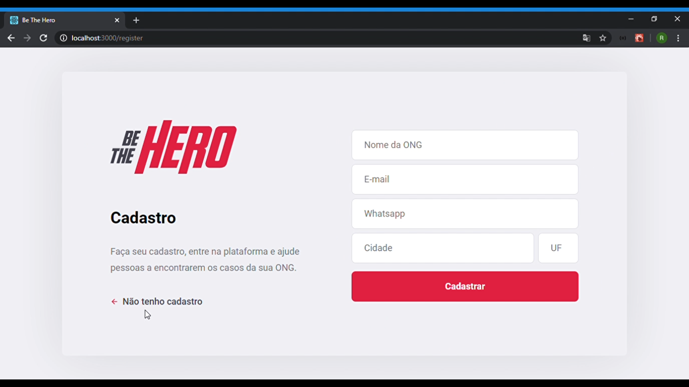
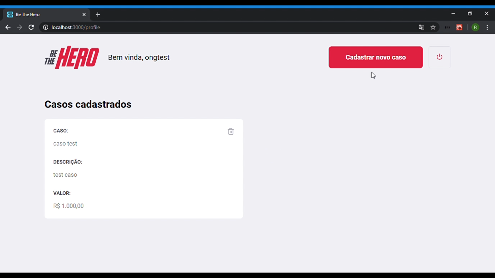
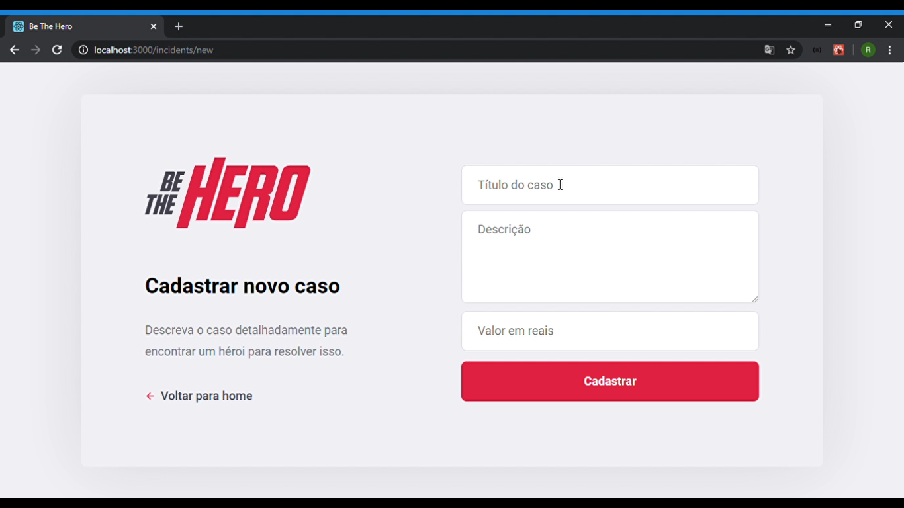

### Tecnologias

Este aplicativo apresenta todas as mais recentes ferramentas e práticas em desenvolvimento web!

- **Node.js** — Back-end da Aplicação
- **ReactJS** — Front-end da Aplicação
- **React Native** — Versão do App mobile

### Introdução

Essa é a introdução do Be The Hero que tem como objetivo levar pessoas que desejam ajudar ONG's até as mesmas.

### Telas da Aplicação

